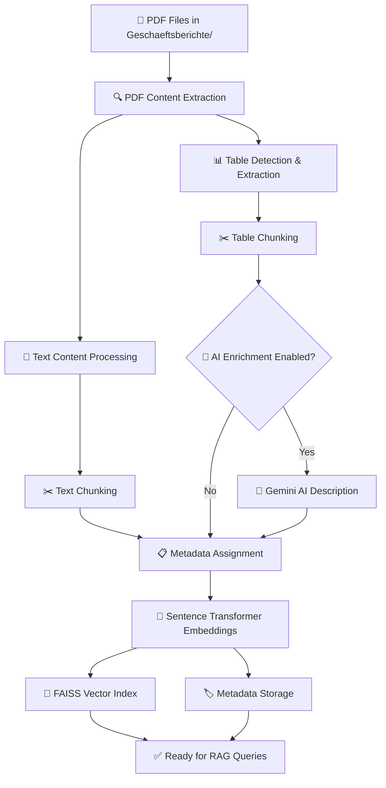
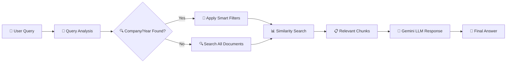

# 📄 Adding New Documents to the RAG System

This guide explains how to add new business reports to the RAG (Retrieval-Augmented Generation) system and what happens behind the scenes during document processing.

## 🚀 Quick Start

To add new documents to your RAG system:

1. **Setup API key**: Copy `.env.example` to `.env` and add your Google Gemini API key
2. **Place PDF files** in the `Geschaeftsberichte/` directory  
3. **Run the pipeline**: `python main.py`
4. **Use the system**: `streamlit run app.py`

## 📋 Prerequisites

- Python 3.10+
- All dependencies installed: `pip install -r requirements.txt`
- Google Gemini API key (for table enrichment)
- PDF files with proper naming convention
- `.env` file with API key (see setup below)

## 📁 File Naming Convention

Your PDF files should follow this naming pattern for automatic company and year extraction:

```
CompanyName_Year.pdf
```

**Examples:**
- `Continental_2023.pdf`
- `Volkswagen_2022.pdf`
- `BMW_2023.pdf`
- `Mercedes-Benz_2021.pdf`

## 🔄 Complete Processing Pipeline

### Overview Flowchart

```
📄 PDF Files → 🔍 Content Extraction → ✂️ Chunking → 🤖 AI Enrichment → 🧮 Embeddings → 💾 FAISS Index
```

### Detailed Process Flow



## 📝 Step-by-Step Process

### 1. 🔍 **PDF Content Extraction**

**What happens:**
- Uses `unstructured` library to parse PDF files
- Extracts text content, tables, and document structure
- Preserves formatting and layout information

**Code location:** `src/processing/table_extractor.py`

**Output:** List of content elements with type information

### 2. ✂️ **Content Chunking**

**What happens:**
- Splits large documents into manageable chunks
- Preserves semantic coherence
- Handles tables and text differently
- Extracts company name and year from filename

**Parameters:**
- **Chunk size**: 1000 characters
- **Overlap**: 200 characters
- **Table handling**: Special processing for tabular data

**Code location:** `src/processing/chunk_processor.py`

**Output:** List of chunks with metadata

### 3. 🤖 **AI Enrichment (Optional)**

**What happens:**
- Uses Google Gemini AI to analyze table content
- Generates human-readable descriptions
- Adds context and explanations for complex data
- Only processes table chunks for efficiency

**Requirements:**
- Google Gemini API key
- Internet connection

**Code location:** `src/processing/chunk_enricher.py`

**Output:** Enhanced chunks with AI descriptions

### 4. 🧮 **Embedding Generation**

**What happens:**
- Converts text chunks to numerical vectors
- Uses sentence-transformers model
- Creates dense vector representations for similarity search

**Model:** `sentence-transformers/all-MiniLM-L6-v2`
- **Dimension**: 384
- **Language**: Multilingual (German supported)

**Code location:** `src/vector/embedder.py`

### 5. 💾 **Vector Database Storage**

**What happens:**
- Stores embeddings in FAISS index
- Saves metadata in pickle format
- Creates searchable vector database

**Files created:**
- `faiss_index.bin` - Vector index
- `chunks_metadata.pkl` - Associated metadata
- `processed_chunks_inspection.json` - Human-readable chunks for inspection

## 📊 Metadata Structure

Each chunk contains the following metadata:

```python
{
    'content': 'Full text content of the chunk',
    'company': 'Continental',
    'year': '2023',
    'source_file': 'Continental_2023.pdf',
    'chunk_type': 'text' or 'table',
    'has_table': True/False,
    'char_count': 856,
    'ai_description': 'AI-generated description (if enriched)',
    'enriched': True/False
}
```

## 🎯 Intelligent Query Processing

When users ask questions, the system uses intelligent pre-filtering:



## 📂 Directory Structure

```
BWLLM/
├── Geschaeftsberichte/          # 📁 Place your PDF files here
│   ├── Continental_2023.pdf
│   ├── Volkswagen_2022.pdf
│   └── BMW_2023.pdf
├── src/
│   ├── processing/              # 🔧 Document processing
│   ├── vector/                  # 🧮 Vector operations
│   └── rag/                     # 🤖 RAG system
├── main.py                      # 🚀 Pipeline runner
├── app.py                       # 🖥️ Streamlit interface
├── inspect_chunks.py           # 🔍 Chunk inspection tool
├── .env                        # 🔑 Environment variables (create from .env.example)
├── faiss_index.bin             # 💾 Generated vector index
├── chunks_metadata.pkl         # 🏷️ Generated metadata
└── processed_chunks_inspection.json  # 📋 Human-readable chunks for review
```

## ⚙️ Configuration Options

### Command Line Usage

```bash
# Basic processing
python main.py

# Custom settings
python main.py \
    --input-dir "path/to/pdfs" \
    --index-path "custom_index.bin" \
    --metadata-path "custom_metadata.pkl" \
    --api-key "your-gemini-key" \
    --log-level "DEBUG"

# Disable AI enrichment
python main.py --no-enrichment
```

### Environment Setup

1. **Copy the example file**:
```bash
cp .env.example .env
```

2. **Edit .env file** and add your API key:
```bash
# Google Gemini API Configuration
GOOGLE_API_KEY=your_actual_api_key_here
```

3. **Get API Key**: Visit https://ai.google.dev/ to get your free Gemini API key

**Note**: The `.env` file is automatically loaded by `main.py` - no manual setup required!

## 🔧 Troubleshooting

### Common Issues

#### 1. **No content extracted from PDF**
- **Cause**: Scanned PDF or complex formatting
- **Solution**: Ensure PDF has selectable text, not just images

#### 2. **Company/Year not recognized**
- **Cause**: Incorrect filename format
- **Solution**: Rename files to `CompanyName_Year.pdf` format

#### 3. **AI enrichment fails**
- **Cause**: Missing/invalid API key, rate limiting, or quota exceeded
- **Solutions**: 
  - Set `GOOGLE_API_KEY` environment variable
  - Check your Gemini API quota at https://ai.google.dev/
  - Wait and retry - the system now handles rate limits automatically
  - Review enrichment success rate in logs

#### 4. **Memory issues with large documents**
- **Cause**: Very large PDF files
- **Solution**: Split large documents or increase system memory

### Debug Mode

```bash
# Run with detailed logging
python main.py --log-level DEBUG
```

### 🔄 Improved Error Handling (NEW!)

The system now includes robust error handling for AI enrichment:

**✅ Features:**
- **Exponential backoff**: Automatic retry with increasing delays
- **Rate limit handling**: Special handling for API quota errors (429)
- **Smart error detection**: Distinguishes between retryable and permanent errors
- **Progress tracking**: Shows success/failure rates during processing
- **Graceful degradation**: Continues processing even if some enrichments fail

**📊 What you'll see in logs:**
```
🚀 Starting table enrichment with improved retry logic...
⏱️ Rate limit hit (attempt 2/6) for Continental_2023.pdf. Waiting 12.3s before retry...
📊 Table enrichment progress: 3/5 - ✅ 2 success, ❌ 1 failed
🎯 Table enrichment completed: ✅ 4/5 tables successful (80.0%)
```

## 📈 Performance Optimization

### For Large Document Collections

1. **Batch Processing**: Process multiple documents in parallel
2. **Index Optimization**: Use different FAISS index types for better performance
3. **Chunking Strategy**: Adjust chunk size based on document types

### FAISS Index Types

```python
# Fast but larger memory usage
index_type = "IndexFlatIP"  # Default

# Memory efficient but slower
index_type = "IndexFlatL2"
```

## 🧪 Testing New Documents

After adding new documents, test the system:

### 1. Check Index Statistics

```python
from src.vector.embedder import get_index_stats

stats = get_index_stats()
print(f"Total documents: {stats['total_entities']}")
print(f"Companies: {list(stats['company_distribution'].keys())}")
print(f"Years: {list(stats['year_distribution'].keys())}")
```

### 2. 🔍 Inspect Processed Chunks (NEW!)

The pipeline automatically creates a transparency file for you to verify processing:

```bash
# After running the pipeline, inspect the processed chunks
python inspect_chunks.py
```

**What you'll see:**
- **Summary statistics** of all processed chunks
- **Table chunks analysis** with AI enrichment status
- **Interactive viewer** to examine specific chunks
- **AI descriptions** to verify table processing quality

**Example output:**
```
📊 TABLE CHUNKS ANALYSIS (15 found)
📋 Table 1:
  🏢 Company: Continental
  📅 Year: 2023
  📄 File: Continental_2023.pdf
  📏 Size: 456 chars
  🤖 AI Enriched: ✅ Yes
  📝 Content Preview: | Umsatz | 2023 | 2022 |...
  🤖 AI Description: Diese Tabelle zeigt die Umsatzentwicklung...
```

### 3. Test Query Processing

```bash
# Start the Streamlit app
streamlit run app.py

# Try sample queries:
# "Wie hoch war der Umsatz von [Company] [Year]?"
# "Zeige mir die Kennzahlen von [Company]"
```

## 🔒 Security Considerations

- **API Keys**: Never commit API keys to version control
- **Data Privacy**: Business reports may contain sensitive information
- **Access Control**: Consider implementing user authentication for production use

## 📚 Additional Resources

- **Streamlit Documentation**: https://docs.streamlit.io/
- **FAISS Documentation**: https://faiss.ai/
- **Sentence Transformers**: https://www.sbert.net/
- **Google Gemini API**: https://ai.google.dev/

## 🤝 Contributing

To extend the system:

1. **Add new file formats**: Extend `table_extractor.py`
2. **Improve chunking**: Modify `chunk_processor.py`
3. **Enhance AI descriptions**: Update prompts in `chunk_enricher.py`
4. **Add new company patterns**: Update `QueryAnalyzer` in `retriever.py`

---

**📞 Need Help?** Check the logs in debug mode or review the error messages for specific guidance.